# 비트 마스크 문제 풀기
## OR 연산  '|'
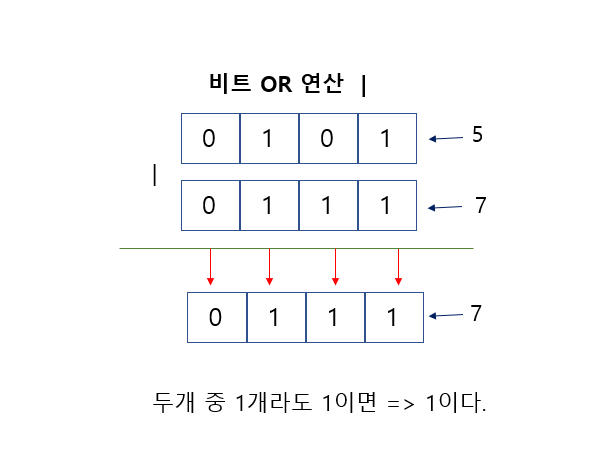

## AND 연산 '&'
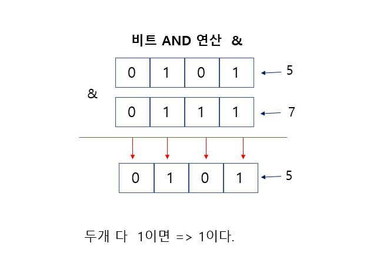


## NOT 연산 '~'
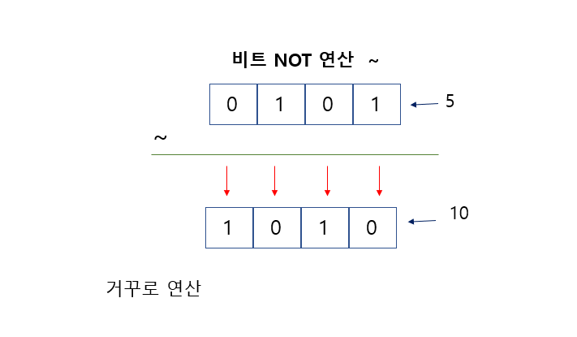

## XOR 연산 '^'
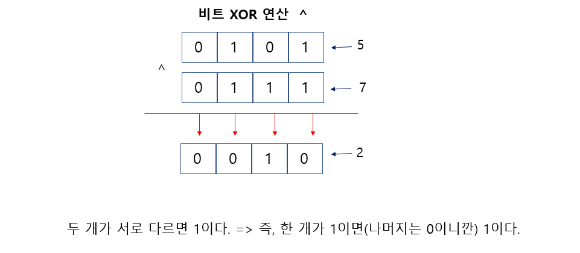

## 응용 

### 자기 자신을 0과 XOR 연산하면  자기 자신이 나온다.

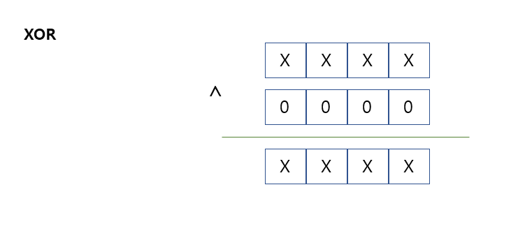


### 자기 자신을 1과 XOR 연산하면   지기 자신과 반대 되는 값이 나온다.

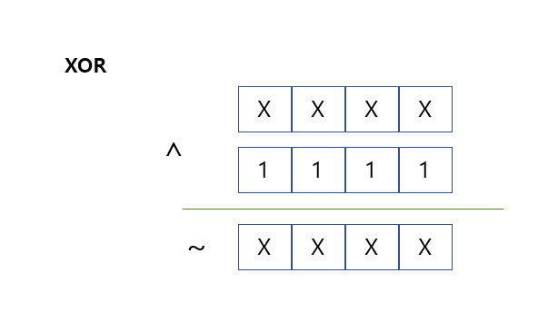


### 자기 자신과 자기 자신을 XOR 연산하면  다른 값이 없으니깐 0이 나온다.

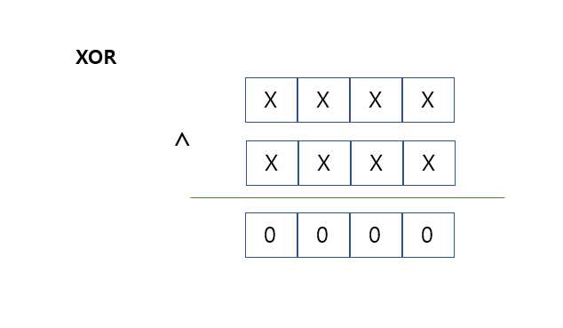

### 자기 자신을  0 으로 AND 연산하면  0이 나온다.

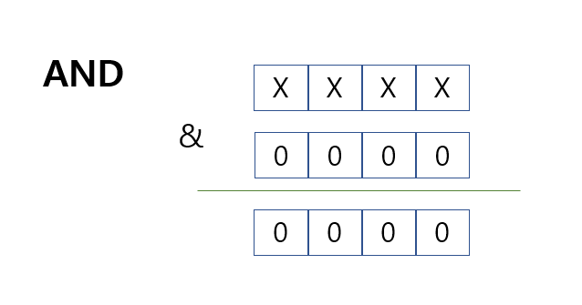

### 자기 자신을 1과 AND 연산하면  자기 자신이 나온다. 

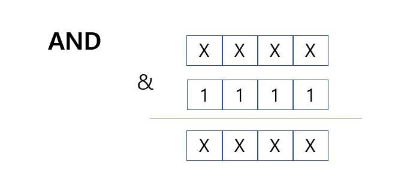

### 자기 자신과 0을 OR 연산하면 자기 자신이 나온다.

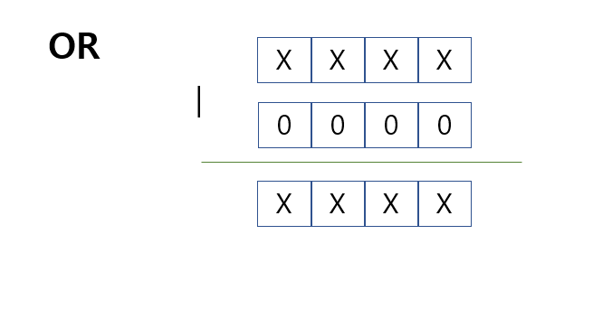


### 자기 자신과 1을 OR 연산하면 1이 나온다.

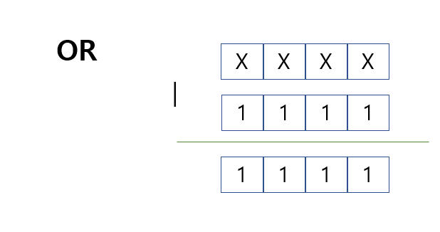


### 자기 자신에서 해당 인덱스 (이진수에 자리) 가 1 인지 0인지 확인하는 법

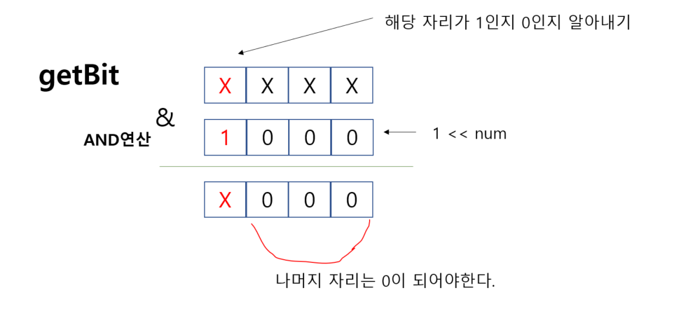

```java
int s = 0;

s & 1 << num == 0
```


### 해당 자리수를 1로 만드는 연산

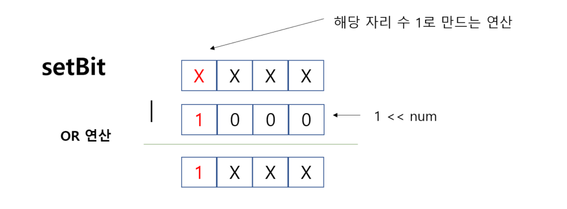

```java
int s = 0;

s = s | 1 << num;
```

### 해당 자리수를 0으로 만드는 연산


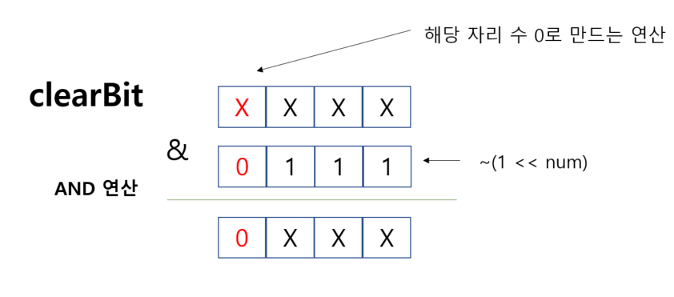

```java
int s = 0;

s = s & ~(1 <<  num);
```