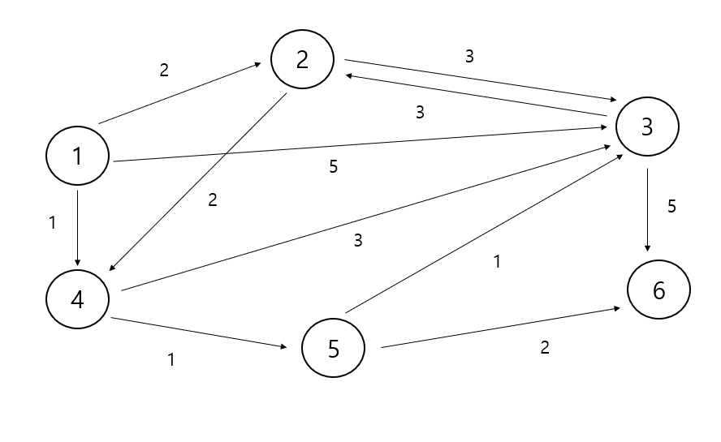

# 간단한 다익스트라




## 입력예시

```java
6 11
1
1 2 2
1 3 5
1 4 1
2 3 3
2 4 2
3 2 3
3 6 5
4 3 3
4 5 1
5 3 1
5 6 2
```

## 출력 예시
```java
0
2
3
1
2
4
```


```java

import java.io.BufferedReader;
import java.io.IOException;
import java.io.InputStreamReader;
import java.util.ArrayList;
import java.util.Arrays;
import java.util.List;
import java.util.StringTokenizer;

class Node {
    int edge;
    int distance;

    public Node(int edge, int distance) {
        this.edge = edge;
        this.distance = distance;
    }
}

public class 간단한다익스트라 {
    static int n, m;
    static List<ArrayList<Node>> graph = new ArrayList<>();
    static boolean visited[];
    static int dy[];

    public static void main(String[] args) throws IOException {
        BufferedReader br = new BufferedReader(new InputStreamReader(System.in));
        StringTokenizer st = new StringTokenizer(br.readLine());
        n = Integer.parseInt(st.nextToken());
        m = Integer.parseInt(st.nextToken());
        visited = new boolean[n + 1];
        dy = new int[n + 1];
        for (int i = 0; i <= n; i++) {
            graph.add(new ArrayList<>());
        }
        int start = Integer.parseInt(br.readLine());
        for (int i = 0; i < m; i++) {
            st = new StringTokenizer(br.readLine());
            graph.get(Integer.parseInt(st.nextToken())).add(new Node(Integer.parseInt(st.nextToken()), Integer.parseInt(st.nextToken())));
        }
        Arrays.fill(dy, Integer.MAX_VALUE);
        dijkstra(start);
        for (int i = 1; i <= n; i++) {
            if (dy[i] == Integer.MAX_VALUE) {
                System.out.println("-1");
            } else {
                System.out.println(dy[i]);
            }
        }
    }

    public static void dijkstra(int start) {
        dy[start] = 0;
        visited[start] = true;
        for (Node edge : graph.get(start)) {
            dy[edge.edge] = edge.distance;
        }
        // 시작 노드 초기화 작업 끝

        // 시작 노드 빼고 모든 노드를 탐색해야 함
        for (int k=1; k<n-1; k++){
            int min = Integer.MAX_VALUE;
            int index = 0;
            for (int i = 1; i <= n; i++) {
                if (dy[i] < min && !visited[i]) {
                    min = dy[i];
                    index = i;
                }
            }
            visited[index] = true;
            for (Node next : graph.get(index)) {
                int cost = dy[index] + next.distance;
                dy[next.edge] = Math.min(cost, dy[next.edge]);
            }
        }
    }
}

```