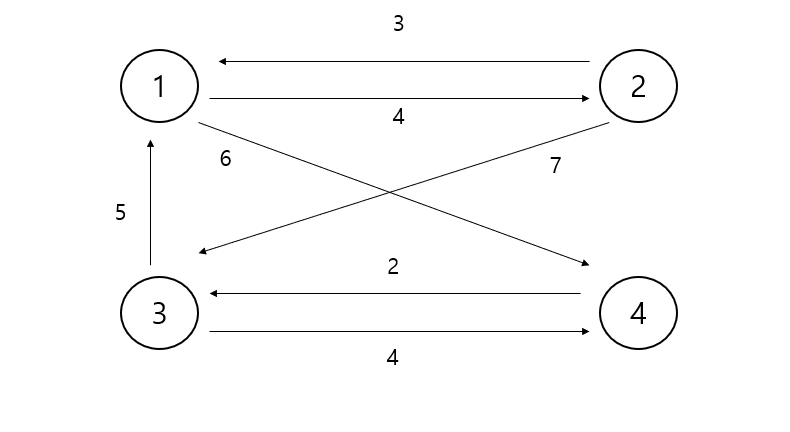
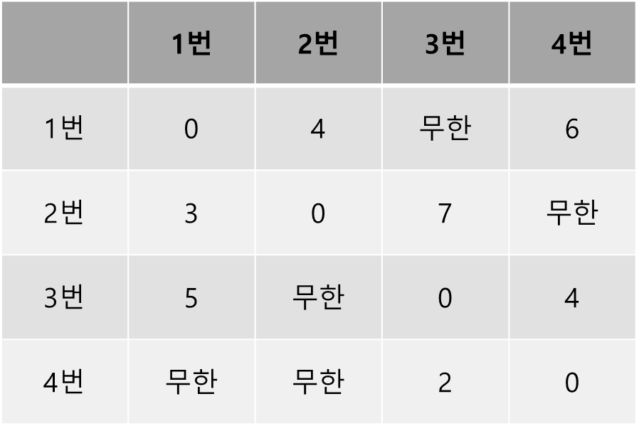

# 플로이드 워셜 알고리즘

플로이드 워셜 알고리즘은 '모든 지점에서 다른 모든 지점까지의 최단 경로를 구해야 하는 경우'에
사용 할 수 있는 알고리즘이다.







## 입력 예시
```java
4
7
1 2 4
1 4 6
2 1 3
2 3 7
3 1 5
3 4 4
4 3 2
```
## 출력 예시
```java
0 4 8 6 
3 0 7 9
5 9 0 4
7 11 2 0
```

```java

public class 플로이드워셜2 {
    static final int INF = (int) 1e9;
    public static void main(String[] args) throws IOException {
        BufferedReader br = new BufferedReader(new InputStreamReader(System.in));
        int n = Integer.parseInt(br.readLine());
        int graph [][] = new int[n+1][n+1];
        int m = Integer.parseInt(br.readLine());
        for (int i=1; i<=n; i++){
            Arrays.fill(graph[i] , INF);
        }
        for (int i=1; i<=n; i++) {
            for (int j=1; j<=n; j++) {
                if (i==j){
                    graph[i][j] = 0;
                }
            }
        }
        while (m-- >0) {
            StringTokenizer st = new StringTokenizer(br.readLine());
            int a = Integer.parseInt(st.nextToken());
            int b = Integer.parseInt(st.nextToken());
            int c = Integer.parseInt(st.nextToken());
            graph[a][b] = c;
        }

        for (int k=1; k<=n; k++) {
            for (int a=1; a<=n; a++) {
                for (int b=1; b<=n; b++) {
                    graph[a][b] = Math.min(graph[a][b] ,graph[a][k]+graph[k][b]);
                }
            }
        }

        for (int a=1; a<=n; a++){
            for (int b=1; b<=n; b++) {
                if (graph[a][b] == INF) {
                    System.out.print("무한 ");
                }else {
                    System.out.print(graph[a][b]+" ");
                }
            }
            System.out.println();
        }


    }
}

```


```java

public class 플로이드워셜 {
    static int INF = (int) 1e9;
    public static void main(String[] args) {
        int [][] graph = {
                {0,4,INF,6},
                {3,0,7,INF},
                {5, INF,0,4},
                {INF,INF,2,0}
        };

        // 플로이드 워셜 알고리즘
        for (int i=0; i<4; i++) {
            for (int j=0; j<4; j++) {
                for (int k=0; k<4; k++) {
                    graph[j][k] = Math.min(graph[j][k] , graph[j][i] + graph[i][k]);
                }
            }
        }
        for (int i=0; i<4; i++) {
            for (int j=0; j<4; j++) {
                if (graph[i][j] == INF) {
                    System.out.print("무한 ");
                }else {
                    System.out.print(graph[i][j]+" ");
                }
            }
            System.out.println();
        }
    }
}

```