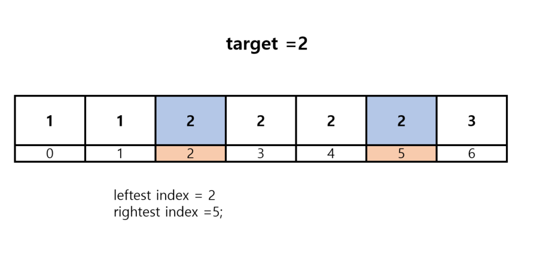
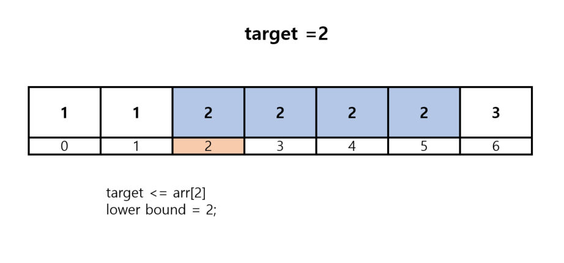
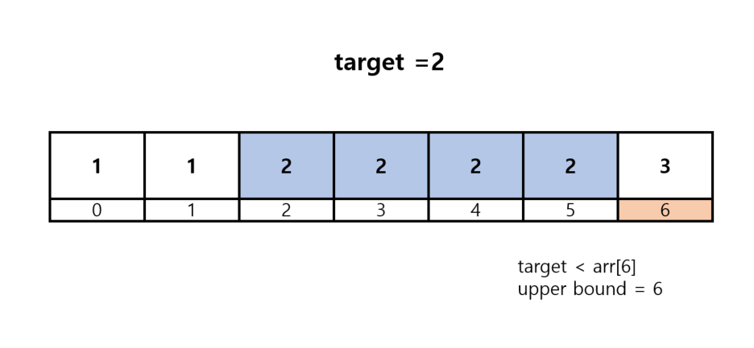

# 정렬된 배열에서 특정 수의 개수 구하기

N개의 원소를 포함하고 있는 수열이 오름차순으로 정렬되어 있습니다. 이때 이 수열에서
x가 등장하는 횟수를 계산하세요. 예를 들어 수열 {1,1,2,2,2,2,3}이 있을 때 x = 2라면,
현재 수열에서 값이 2인 원소가 4개이므로 4를 출력합니다.

단, 이 문제는 시간 복잡도 O(logN)으로 알고리즘을 설계하지 않으면 '시간 초과' 판정을 받습니다.

## 입력 조건
- 첫째 줄에 N과 x가 정수 형태로 공백으로 구분되어 입력됩니다.
(1<=N <= 1,000,000)
- 둘째 줄에 N개의 원소가 정수 형태로 공백으로 구분되어 입력됩니다. (-10<sup>9</sup><= 각 원소의 값 <=10<sup>9</sup>)

### 입력 예시 1

```java
7 2
1 1 2 2 2 2 3
```


### 출력 예시 1
```java
4
```

### 입력 예시 2
```java
7 4
1 1 2 2 2 2 3
```

### 출력 예시 2
```java
-1
```

중복 원소의 개수를 구하기 위해서는

중복 원소의 왼쪽 끝 값과 오른쪽끝 값을 각각 알아 내는 것이다.



그런 뒤 구간의 길이를 구하면 된다.

이 방식으로 접근하기 위해 lower_bound 와 upper_bound 를 알아야 한다.

lower_bound 는 하한을 의미하고, upper_bound 는 상한을 의미한다.

### lower bound
lower_bound는 찾고자 하는 값 이상의 값이 처음으로 나타나는 위치를 의미한다.

즉, 왼쪽 부터 볼 때 찾고자 하는 값이 같거나 큰 경우를 처음 만나는 위치를 의미한다. 



찾고자 하는 값 2를 처음으로 마주하는 지점은 인덱스 2이다.
즉, lower bound의 값은 2이다.

### upper bound

upper bound는 찾고자 하는 값을 초과한 값을 처음 만나는 위치이다.




중복 원소에 대한 길이 = upper_bound - lower_bound

```java
public class 정렬된배열에서특정수의개수구하기 {
    public static void main(String[] args) throws IOException {
        BufferedReader br = new BufferedReader(new InputStreamReader(System.in));
        StringTokenizer st = new StringTokenizer(br.readLine());
        // 데이터의 개수 n , 찾고자 하는 값 x
        int n = Integer.parseInt(st.nextToken());
        int x = Integer.parseInt(st.nextToken());
        int arr[] = new int[n];
        st = new StringTokenizer(br.readLine());
        // 전체 데이터 입력 받기
        for (int i = 0; i < n; i++) {
            arr[i] = Integer.parseInt(st.nextToken());
        }
        // 값이 x ~ x 범위에 있는 데이터의 개수 계산
        int cnt = countByRange(arr,x,x);
        if (cnt == 0){
            System.out.println(-1);
        }else {
            System.out.println(cnt);
        }
    }
    // 값이 leftValue 인 위치 구하기
    public static int lowerBound(int[]arr, int target , int start , int end) {
        while (start <end) {
            int mid = (start+end) /2;
            if (arr[mid] >= target) {
                end = mid;
            }else {
                start = mid +1;
            }
        }
        return end;
    }
    // 값이 rightValue 인 위치 구하기
    public static int upperBound(int []arr , int tartget , int start, int end) {
        while (start < end){
            int mid =(start + end) / 2;
            if (arr[mid] > tartget){
                end = mid;
            }
            else {
                start = mid +1;
            }
        }
        return end;
    }

    //값이 left_value ~ right_value 인 데이터의 개수를 반환하는 함수
    public static int countByRange(int[]arr , int leftValue , int rightValue) {
        int rightIndex = upperBound(arr,rightValue ,0, arr.length);
        int leftIndex = lowerBound(arr,leftValue,0,arr.length);
        return rightIndex -leftIndex;
    }
}

```