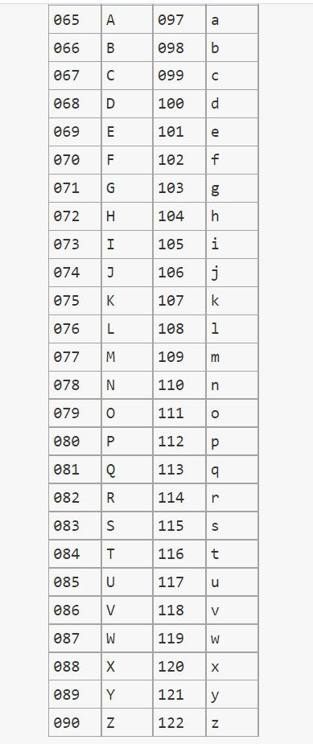

# 아스키 코드

아스키코드 65 ~ 90 =>  대문자 A ~ Z 

아스키코드 97 ~ 122 => 소문자 a ~ z



```java
ublic class Ascii {
    public static void main(String[] args) {

        int e = 122;
        char c = (char) e;
        System.out.println("c = " +c);

        System.out.println("=============");

//        for (int i = 65; i<91; i++){
//            System.out.println((char) i);
//        }

        for (int i = 97; i<123; i++){
            System.out.println((char) i);
        }


    }
}

```

아스키코드 48~ 57 ->  숫자 0 ~ 9

```java

public class Ascii_1 {
    public static void main(String[] args) {

//        char c1  ='0';
//        char c2 = '9';
//        int exam = c1;
//        int exam1 = c2;
//
//        System.out.println(exam);
//        System.out.println(exam1);

        for (int i=48; i<=57; i++){
            System.out.println((char) i);
        }

    }
}

```

```java
public class Main {
    public static void main(String[] args) {
        char c = '0';
        c += 3;
        System.out.println(c); // 3
        System.out.println('9' == 57); // true
        System.out.println('3'+('3'-48)); // 54
        char ex = 0+'0'; // 아스키 코드 48
        char ex2 = 0; // 아스키 코드 0
        System.out.println(ex); // 0 출력
        System.out.println(ex2+'0'); // 48 출력 <- int 로 형변환
        int i = '5' + '4';  // <- char 형 사칙 연산은 int 형으로 자동 형 변호나 됨
        System.out.println(i); // 105
    }
}
```