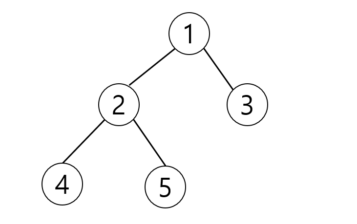

# Tree 말단 노드까지의 가장 짧은 경로 (DFS)

아래 그림과 같은 이진트리에서 루트 노드 1에서 말단노드까지의 길이 중 가장 짧은 길이를
구하는 프로그램을 작성하세요
각 경로의 길이는 루트노드에서 말단노드까지 가는데 이동하는 횟수를 즉 간선의 개수를 길이로 하겠습니다.



가장 짧은 길이는 3번 노드까지의 길이인 1이다.

```java

class Node1 {
    int data;
    Node1 lt, rt;

    public Node1(int data) {
        this.data = data;
        lt = rt = null;
    }
}

public class Tree_DFS {
    Node1 root;

    public int DFS(int L, Node1 root) {
        if (root.lt == null && root.rt == null) {
            return L;
        }

        return Math.min(DFS(L + 1, root.lt), DFS(L + 1, root.rt));

    }

    public static void main(String[] args) {
        Tree_DFS tree = new Tree_DFS();
        tree.root = new Node1(1);
        tree.root.lt = new Node1(2);
        tree.root.rt = new Node1(3);
        tree.root.lt.lt = new Node1(4);
        tree.root.lt.rt = new Node1(5);
        System.out.println(tree.DFS(0, tree.root));
    }
}

```