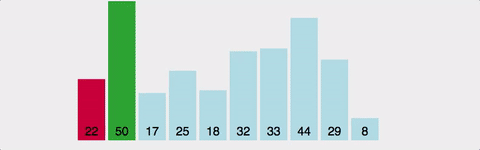

# 선택 정렬 (Selection Sort)

데이터가 무작위로 여러 개 있을 때, 

이 중에서 가장 작은 데이터를 선택해 맨 앞에 있는 데이터와 바꾸고, 그 다음 작은 데이터를 선택해 
앞에서 두 번째 데이터와 바꾸는 과정이다.

반대로 가장 큰 수를 찾아서 배열의 마지막 위치와 바꿔도 된다.



선택 정렬의 시간 복잡도를 계산해보면

N-1 번 만큼 가장 작은 수를 찿아서 맨 앞으로 보내야 한다.
또한 매번 가장 작은 수를 찾기 위해서 비교 연산이 필요하다. 
구현 방식에 따라서 사소한 오차는 있을 수 있지만 
보통 근사치로 N * (N+1) / 2 번의 연산을 수행한다고 보면 된다.

빅오 표기법으로는 간단히 O(N<sup>2</sup>)로 표현할 수 있다.


`가장 작은 데이터를 맨 앞에 있는 데이터와 바꾸는 경우`

```java

public class SelectionSort {
    public static void main(String[] args) {
        int array[] = {7,5,9,0,3,1,6,2,4,8};

        for (int i=0; i<array.length; i++) {
            int mid_index = i;
            for (int j=i+1; j < array.length; j++) {
                if (array[mid_index] > array[j]) {
                    mid_index = j;
                }
            }
            int temp = array[mid_index];
            array[mid_index] = array[i];
            array[i] = temp;
        }
        for (int a : array){
            System.out.print(a+" ");
        }


    }
}

```

`가장 큰 데이터를 맨 뒤에 있는 데이터와 바꾸는 경우

```java
public class SelectionSort {
    public static void main(String[] args) {
        int array[] = {7,5,9,0,3,1,6,2,4,8};

        for (int i=array.length-1; i>=0; i--) {
            int mid_index = i;
            for (int j=i-1; j >=0 ; j--) {
                if (array[mid_index] < array[j]) {
                    mid_index = j;
                }
            }
            int temp = array[mid_index];
            array[mid_index] = array[i];
            array[i] = temp;
        }
        for (int a : array){
            System.out.print(a+" ");
        }
    }
}````