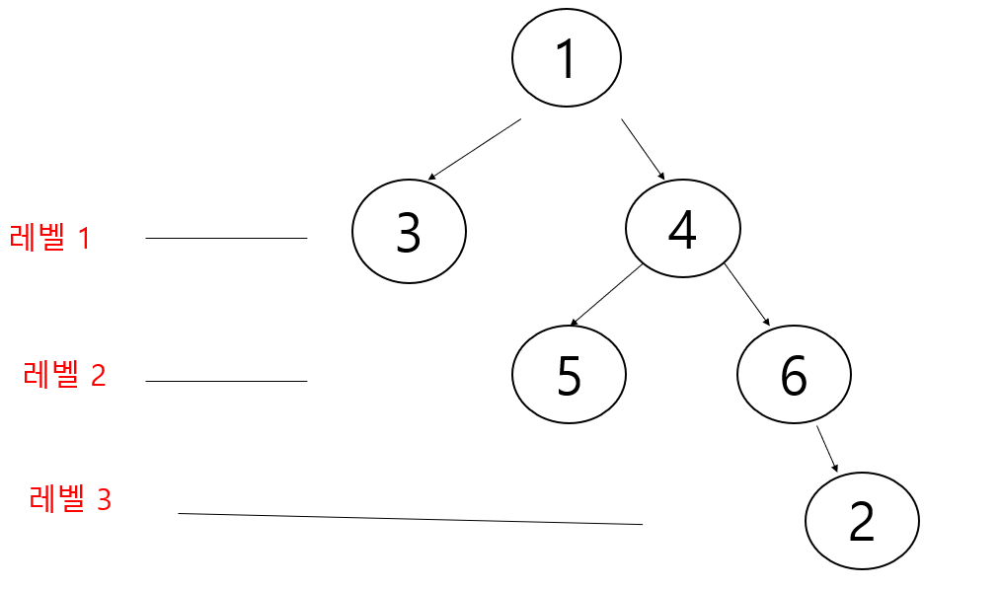

# 그래프 최단거리(BFS)

다음 그래프에서 1번 정점에서 각 정점으로 가는 최소 이동 간선수를 출력하세요


## 입력 설명

첫째 줄에는 정점의 수 N(1<=N<=20) 와 간선의 수 M가 주어진다. 그 다음부터 M줄에  걸쳐 연결정보가 주어진다.

## 출력 설명

1번 정점에서 각 정점으로 가는 최소 간선수를 2번 정점 부터 차례대로 출력하세요
 
## 입력 예제
```java
6 9
1 3
1 4
2 1
2 5
3 4
4 5
4 6
6 2
6 5
```

## 출력 예제
```java
2 : 3
3 : 1
4 : 1
5 : 2
6 : 2
```

최단거리 BFS 사용



풀이 1
```java

public class 그래프최단거리_BFS {
    static ArrayList<ArrayList<Integer>> graph = new ArrayList<>();
    static boolean check [];
    static int dir [];
    public static void main(String[] args) throws IOException {
        BufferedReader br = new BufferedReader(new InputStreamReader(System.in));
        StringTokenizer st = new StringTokenizer(br.readLine());
        int N = Integer.parseInt(st.nextToken());
        int M = Integer.parseInt(st.nextToken());
        check = new boolean[N+1];
        dir = new int[N+1];
        for (int i=0; i<=N; i++) {
            graph.add(new ArrayList<>());
        }
        for (int i=0; i<M; i++) {
            st = new StringTokenizer(br.readLine());
            int a = Integer.parseInt(st.nextToken());
            int b = Integer.parseInt(st.nextToken());
            graph.get(a).add(b);
        }
        bfs();
        for (int i=2; i<=N; i++) {
            System.out.println(i+" : " +dir[i]);
        }
    }
    public static void bfs() {
        Queue<Integer> queue = new LinkedList<>();
        for (int i : graph.get(1)) {
            check[i] = true;
            dir[i] = dir[1]+1;
            queue.offer(i);
        }

        while (!queue.isEmpty()) {
            int i  = queue.poll();
            for (int g : graph.get(i)){
                if (!check[g]) {
                    check[g] = true;
                    dir[g] = dir[i]+1;
                    queue.offer(g);
                }
            }

        }
    }
}

```

풀이 2

```java

public class 그래프최단거리_BFS {
    static ArrayList<ArrayList<Integer>> graph = new ArrayList<>();
    static boolean check[];
    static int dir[];

    public static void main(String[] args) throws IOException {
        BufferedReader br = new BufferedReader(new InputStreamReader(System.in));
        StringTokenizer st = new StringTokenizer(br.readLine());
        int N = Integer.parseInt(st.nextToken());
        int M = Integer.parseInt(st.nextToken());
        check = new boolean[N + 1];
        dir = new int[N + 1];
        for (int i = 0; i <= N; i++) {
            graph.add(new ArrayList<>());
        }
        for (int i = 0; i < M; i++) {
            st = new StringTokenizer(br.readLine());
            int a = Integer.parseInt(st.nextToken());
            int b = Integer.parseInt(st.nextToken());
            graph.get(a).add(b);
        }
        bfs(1);
        for (int i = 2; i <= N; i++) {
            System.out.println(i + " : " + dir[i]);
        }
    }

    public static void bfs(int v) {
        Queue<Integer> queue = new LinkedList<>();
        check[v] = true;
        queue.offer(v);
        while (!queue.isEmpty()) {
            int cv = queue.poll();
            for (int nv : graph.get(cv)) {
                if (!check[nv]) {
                   check[nv] = true;
                   dir[nv] = dir[cv]+1;
                   queue.offer(nv);
                }
            }
        }
    }
}

```