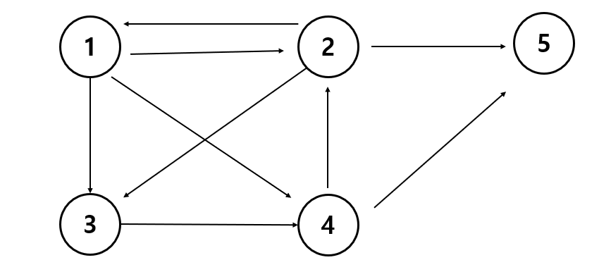

# 경로 탐색(인접행렬)

방향그래프가 주어지면 1번 정점에서 N번 정점으로 가는 모든 경로의 가지 수를 출력하는 프로그램을
작성하세요 아래 그래프에서 1번 정점에서 5번 정점으로 가는 가지 수는 



```java
1 2 3 4 5
1 2 5
1 3 4 2 5
1 3 4 5
1 4 2 5
1 4 5
```

6 가지

## 입력 설명
첫째 줄에는 정점의 수 N(1<=N<=20)와 간선의 수 M이 주어진다. 그 다음부터 M줄에 걸쳐 연결정보가 주어진다.

## 출력 설명!

총 가지수를 출력한다.

## 입력 예제

````java
5 9
1 2
1 3
1 4
2 1
2 3
2 5
3 4
4 2
4 5
````

## 출력 예제

```java
6
```


```java

import java.util.Scanner;

public class 경로탐색 {
    static int N , M , answer = 0;
    static int [] ch;
    static int[][] graph;
    public static void main(String[] args) {
        Scanner scanner = new Scanner(System.in);
        N =scanner.nextInt();
        M =scanner.nextInt();
        graph = new int[N+1][N+1];
        for (int i= 0; i<M; i++) {
            int a = scanner.nextInt();
            int b = scanner.nextInt();
            graph[a][b] = 1;
        }
        ch = new int[N+1];
        ch[1] = 1;
        dfs(1);
        System.out.println(answer);
    }
    public static void dfs(int L) {
        if (L == N) {
            answer++;
            return;
        }
        for (int i=1; i<= N; i++) {
            if (graph[L][i] == 1 && ch[i] == 0) {
                ch[i] = 1;
                dfs(i);
                ch[i] = 0;
            }
        }
    }
}
```