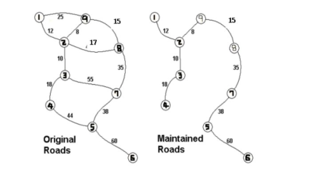

# 원더랜드 (최소스패닝 트리)

## 설명

원더랜드에 문제가 생겼다. 원더랜드의 각 도로를 유지보수하는 재정이 바닥난 것이다.

원더랜드는 모든 도시를 서로 연결하면서 최소의 유지비용이 들도록 도로를 선택하고 나머지 도로는 폐쇄하려고 한다.

아래의 그림은 그 한 예를 설명하는 그림이다.




## 입력
첫째 줄에 도시의 개수 V(1≤V≤100)와 도로의 개수 E(1≤E≤1,000)가 주어진다.

다음 E개의 줄에는 각 도로에 대한 정보를 나타내는 세 정수 A, B, C가 주어진다.

이는 A번 도시와 B번 도시가 유지비용이 C인 도로로 연결되어 있다는 의미이다.


## 출력
모든 도시를 연결하면서 드는 최소비용을 출려한다.

## 예시 입력

```java
9 12
1 2 12
1 9 25
2 3 10
2 8 17
2 9 8
3 4 18
3 7 55
4 5 44
5 6 60
5 7 38
7 8 35
8 9 15
```

## 예시 출력

```java
196
```

```java

class Edge implements Comparable<Edge> {
    int vex;
    int cost;

    public Edge(int vex, int cost) {
        this.vex = vex;
        this.cost = cost;
    }

    @Override
    public int compareTo(Edge o) {
        return this.cost - o.cost;
    }
}

public class 원더랜드 {
    public static void main(String[] args) throws IOException {
        BufferedReader br = new BufferedReader(new InputStreamReader(System.in));
        StringTokenizer st = new StringTokenizer(br.readLine());
        int V = Integer.parseInt(st.nextToken());
        int E = Integer.parseInt(st.nextToken());
        List<ArrayList<Edge>> graph = new ArrayList<>();
        boolean [] visited = new boolean[V+1];
        for (int i=0; i<=V; i++) {
            graph.add(new ArrayList<>());
        }
        while (E-- > 0) {
            st = new StringTokenizer(br.readLine());
            int a = Integer.parseInt(st.nextToken());
            int b = Integer.parseInt(st.nextToken());
            int c = Integer.parseInt(st.nextToken());
            graph.get(a).add(new Edge(b,c));
            graph.get(b).add(new Edge(a,c));
        }
        PriorityQueue<Edge> priorityQueue = new PriorityQueue<>();
        priorityQueue.offer(new Edge(1,0));
        int cost  = 0;
        while (!priorityQueue.isEmpty()) {
            Edge current = priorityQueue.poll();
            if (!visited[current.vex]){
                visited[current.vex] = true;
                cost += current.cost;
                for (Edge edge : graph.get(current.vex)){
                    if (!visited[edge.vex]) {
                        priorityQueue.offer(edge);
                    }
                }
            }

        }
        System.out.println(cost);
    }
}

```